# bKash Payment Gateway Integration with Next.js (including API)

- Deployed link
  - <https://bkash-nextjs.vercel.app>
  - <https://bkash.devarif.me>

## Getting Started

First, run the development server:

```bash
npm run dev
# or
yarn dev
# or
pnpm dev
# or
bun dev
```

Open <http://localhost:3000> with your browser to see the result.

## Routes

- `/` - Home page
- `/checkout` - Checkout page
- `/success` - Success page
- `/cancel` - Cancel page

## API

- `/api/payment-methods` - Payment Methods API
- `/api/payment` - Payment API
- `/api/callback` - Callback API

## Environment Variables

Create a `.env.local` file in the root directory and add the following environment variables:

```bash
# bKash
BKASH_BASE_URL=''
BKASH_CHECKOUT_URL_USER_NAME=''
BKASH_CHECKOUT_URL_PASSWORD=''
BKASH_CHECKOUT_URL_APP_KEY=''
BKASH_CHECKOUT_URL_APP_SECRET=''

# Database
MONGO_URI=""
```

## Screenshots

<details>
<summary>Click to expand project screenshots</summary>

### User Flow Screenshots

| Stage | Screenshot |
|-------|------------|
| Home Page | 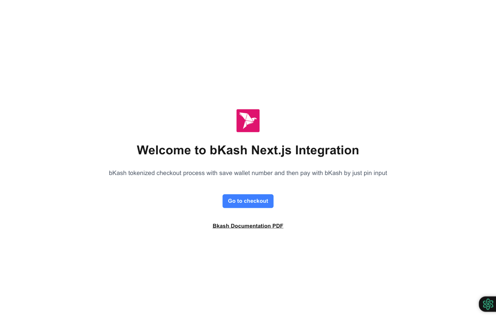 |
| Checkout - Fetching Payment Methods | 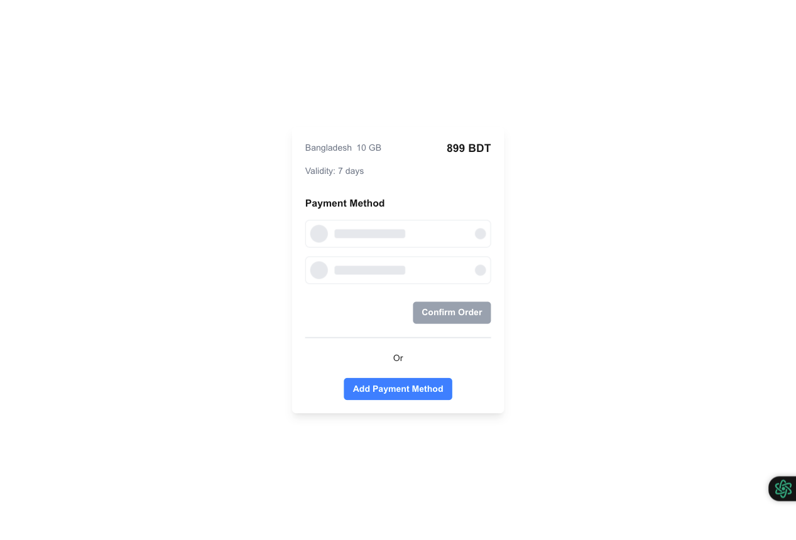 |
| Checkout - No Payment Methods | 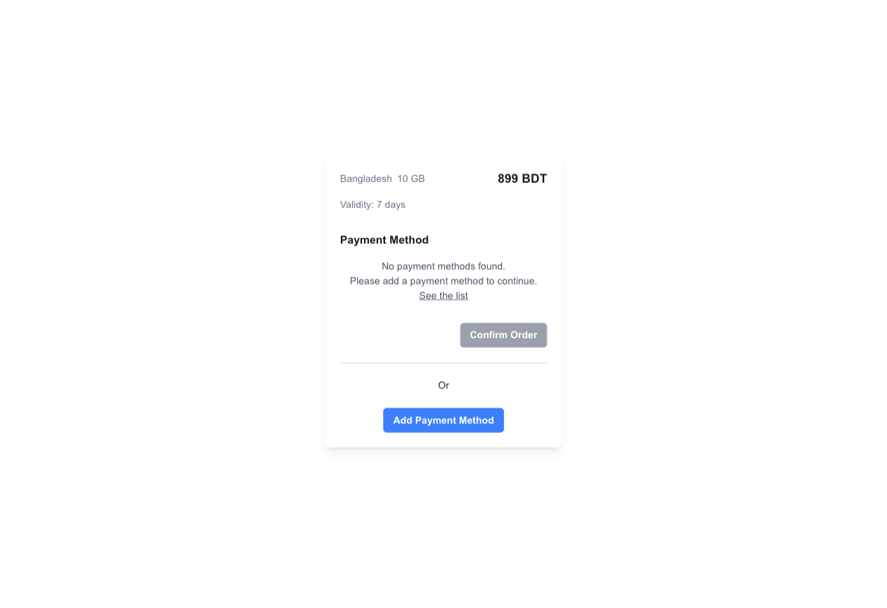 |

### Payment Method Flow

| Stage | Screenshot |
|-------|------------|
| Add Payment Method | 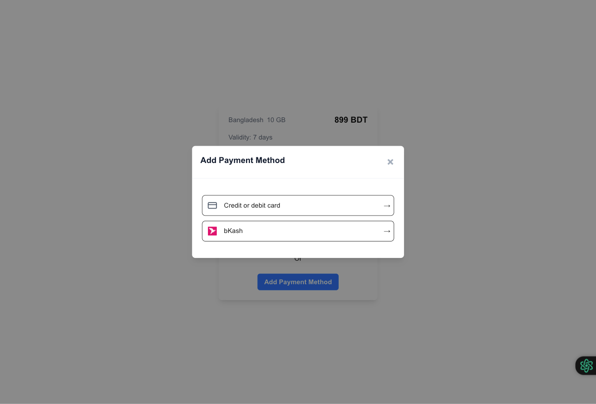 |
| bKash Wallet Input | 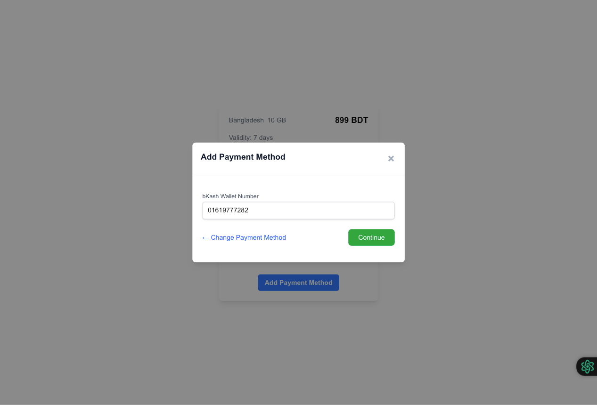 |
| Save Wallet UI |  |

### Authentication and Confirmation

| Stage | Screenshot |
|-------|------------|
| OTP Input | 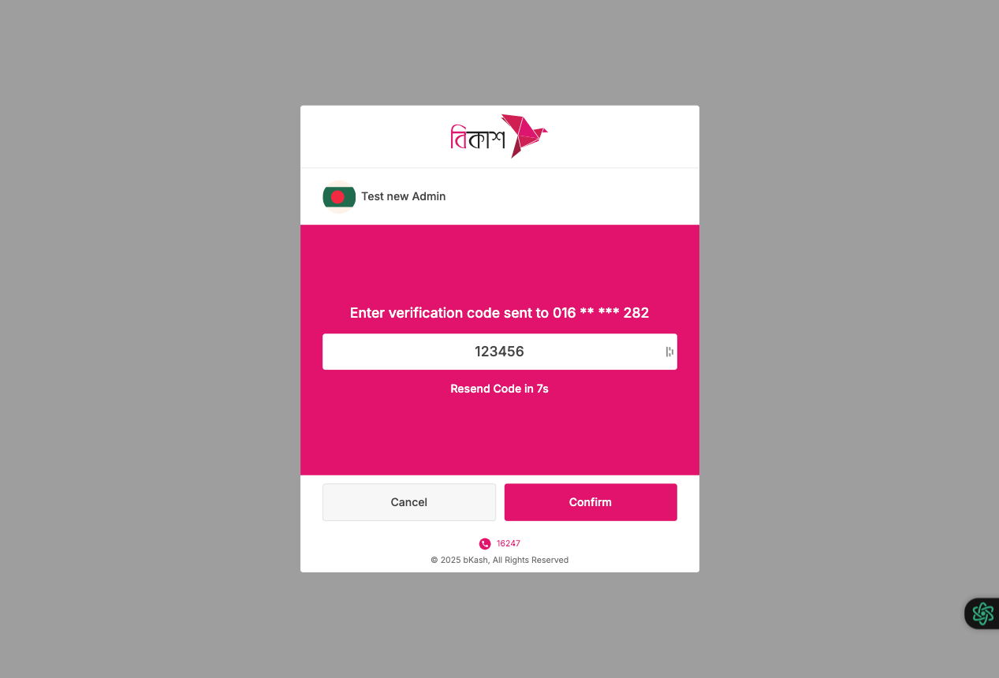 |
| Wallet Save Success | 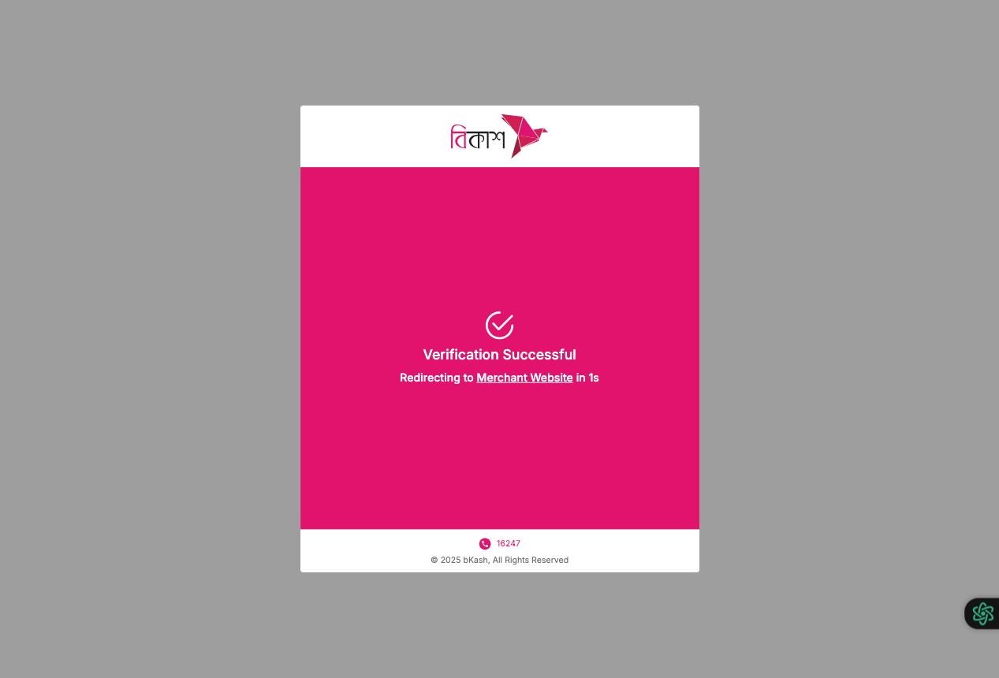 |
| Checkout with Payment Method | 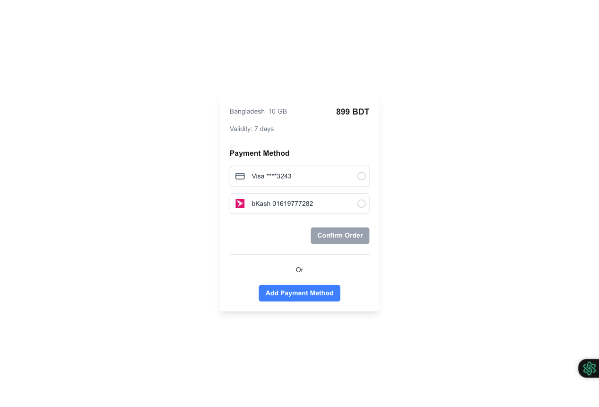 |

### Transaction States

| Stage | Screenshot |
|-------|------------|
| Confirm Order PIN | 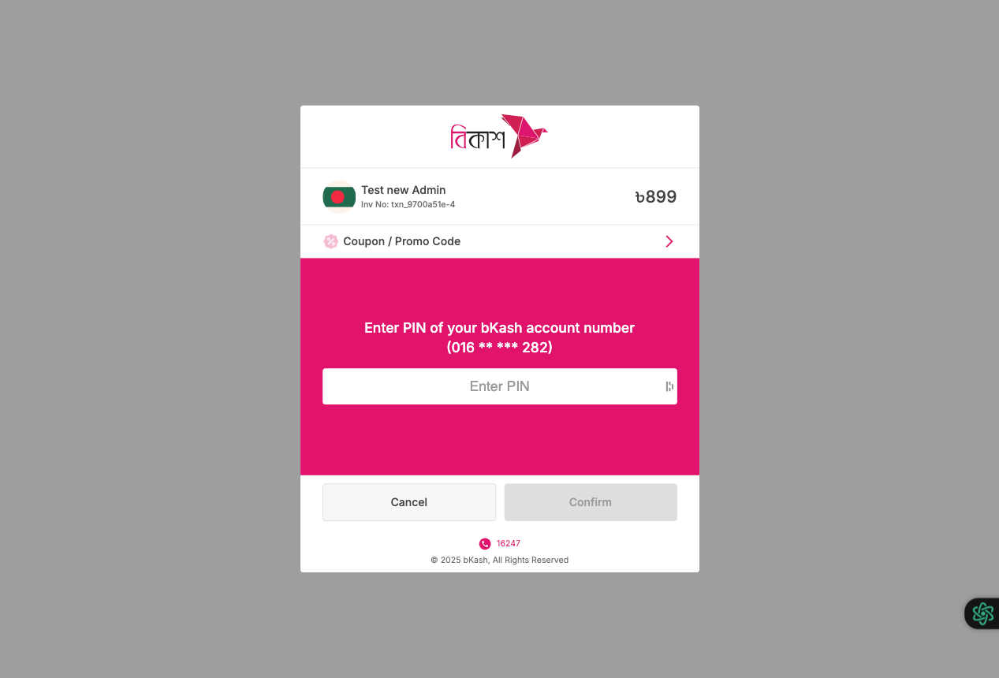 |
| Payment Failed | 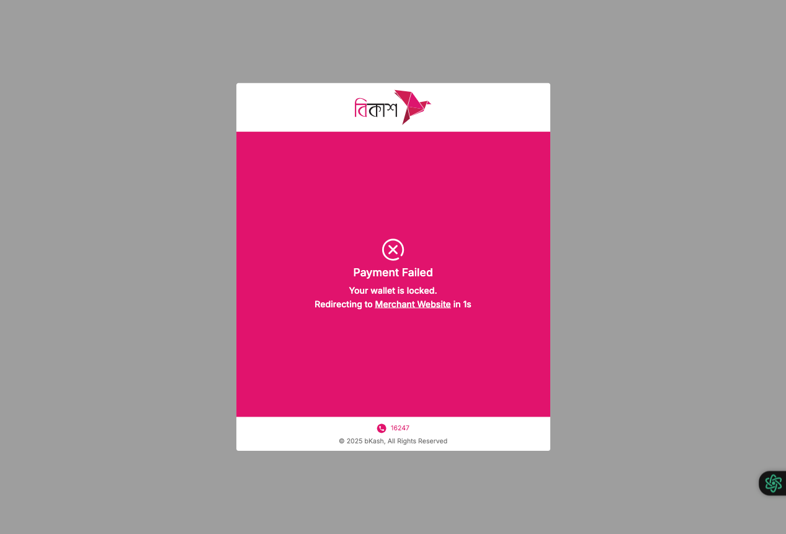 |
| Transaction Cancelled | 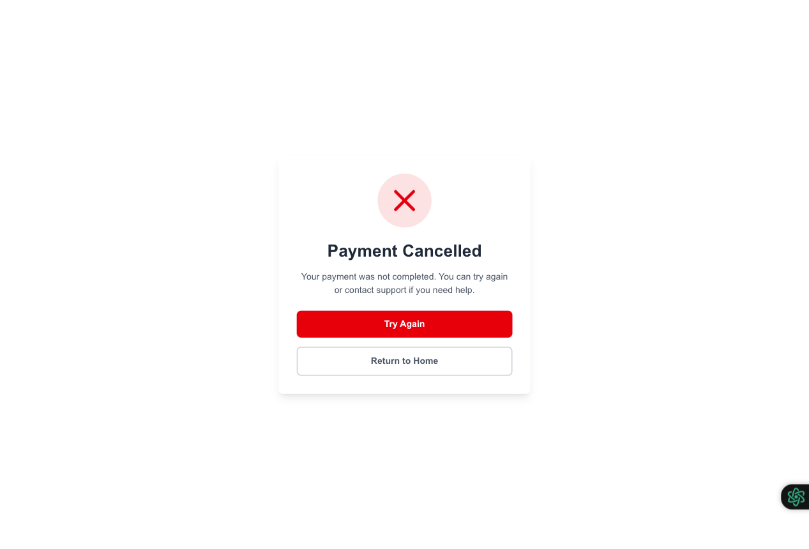 |
| Payment Success | 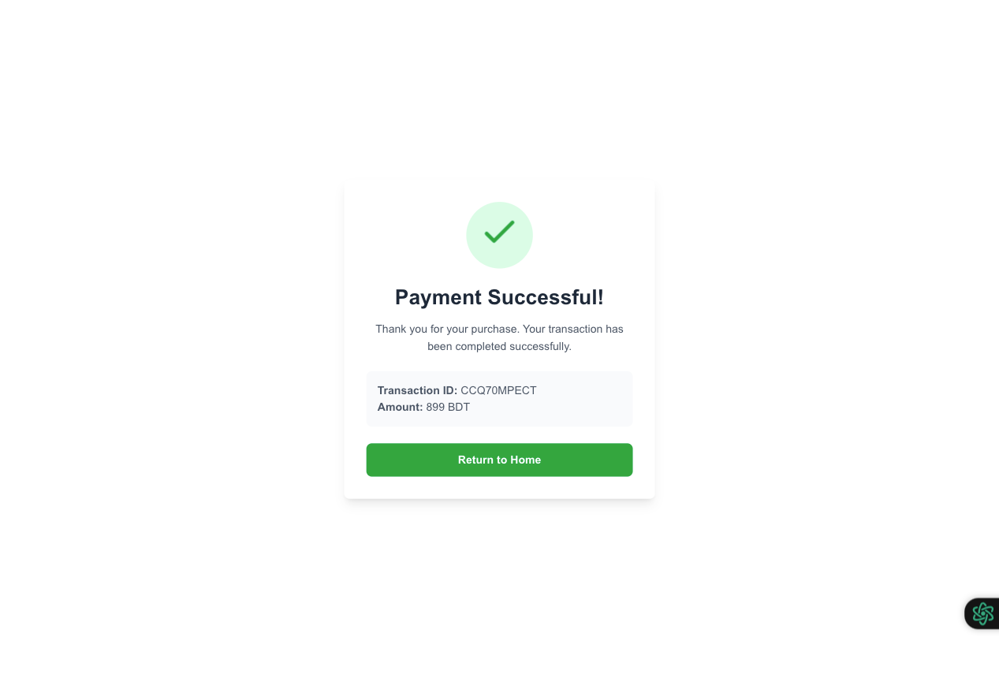 |

</details>

### Screenshot Viewing Tips

- Click on the "Click to expand project screenshots" dropdown to view all screenshots
- Screenshots are organized by user flow and transaction stages
- Each screenshot is labeled for easy reference

## Task left

- [ ] Add refund API
- [ ] Add payment query API
